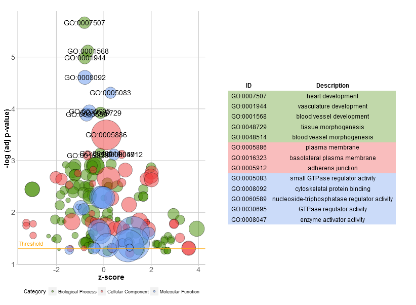
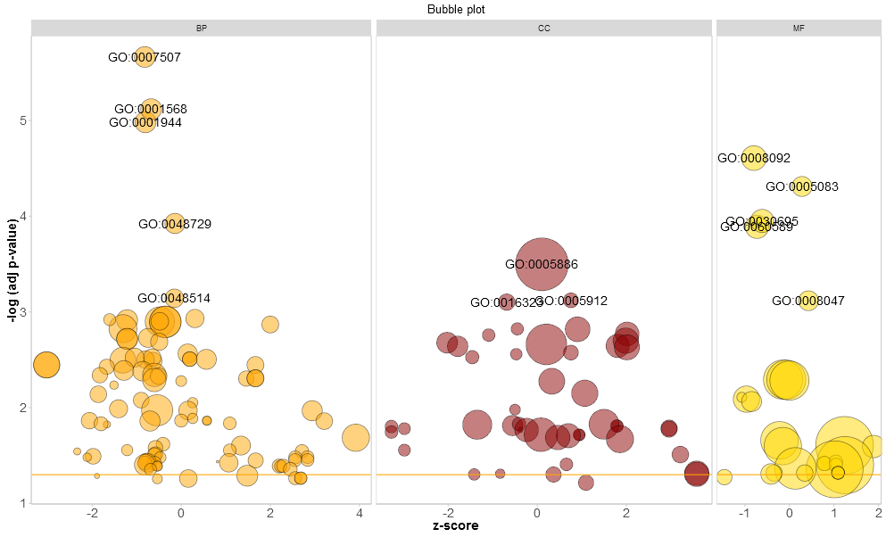
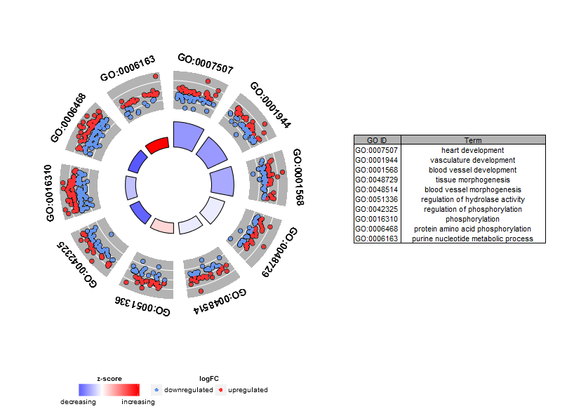
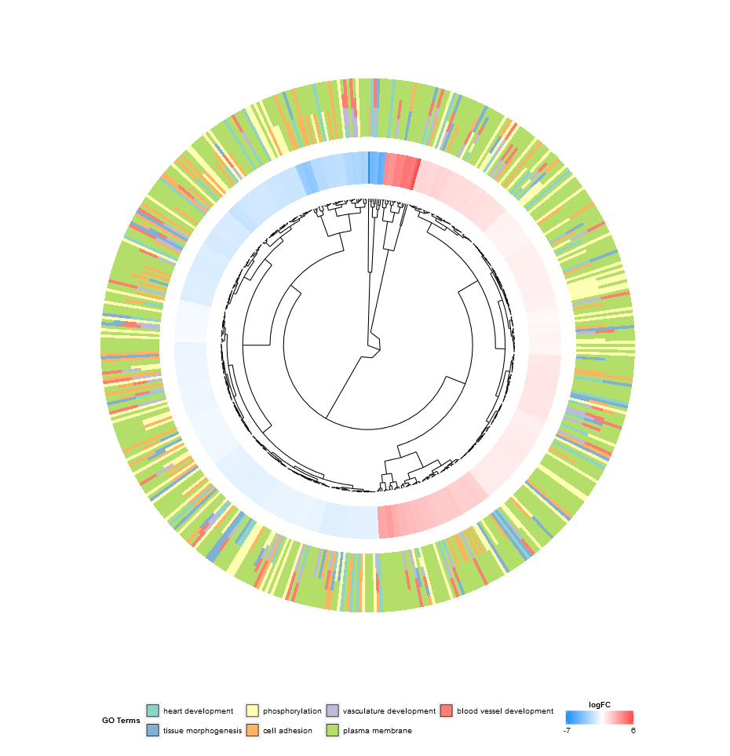
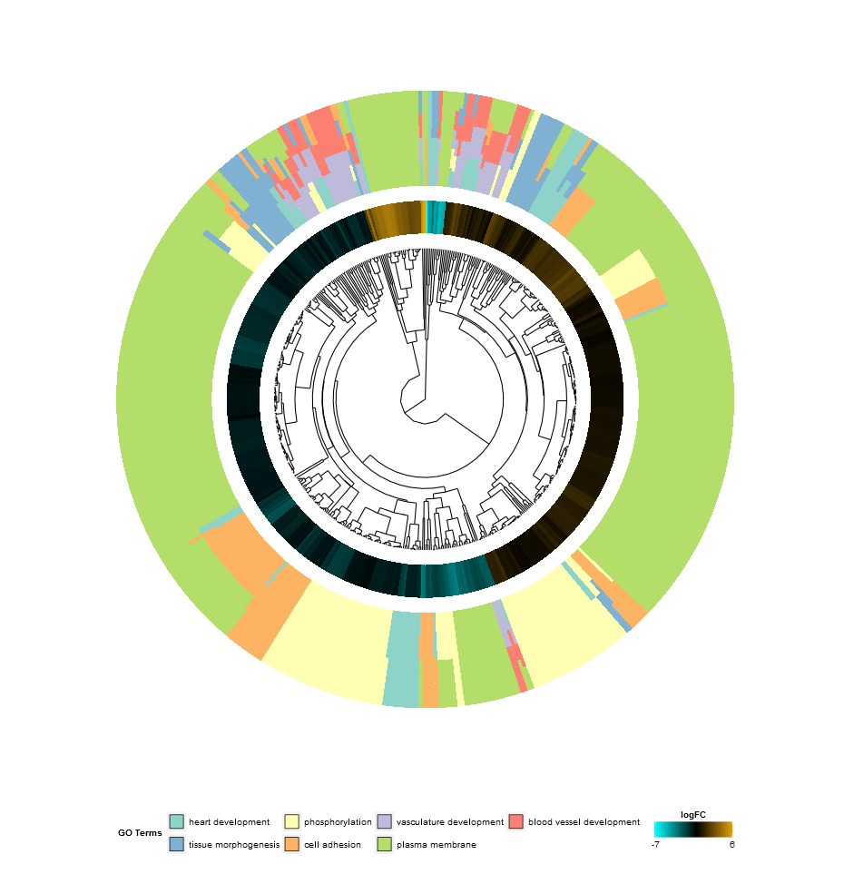

A manual to exploit the possibilities and limitations of the R package GOplot.


##Introduction
The GOplot package concentrates on the visualization of biological data. More precisely, the package will help combine and integrate expression data with the results of a functional analysis. The package cannot be used to perform any of these analyses. It is for visualization purpose only. In all the scientific fields we visualize information to meet a basic need- to tell a story. Attributable to space restrictions and a general need to present everything neat and tidy most of the times it is simply not possible to actually tell a story. Therefore, we use vision to communicate information. A well designed and elaborated figure provides the beholder with high-dimensional information in a much smaller space than for example a table. The idea of the package is to provide the user with functions that allow a quick examination of large amounts of data, expose trends and find patterns & correlations within the data. Effective data visualization is an important tool in the decision making process and helps to find further pieces of the puzzle picturing the answer of your biological question. Based on that you will be able to confirm or falsify your hypotheses. You might even start to look in a different direction to investigate your topic relying on the insight a new visualization provides. The plotting functions of the package were developed with a hierarchical structure in mind; starting with a general overview and closing with definite subsets of selected genes and terms. To explain the idea let us use an example.

##The toy example
GOplot comes with a manually compiled data set. Selected samples were downloaded from gene expression omnibus (accession number: [GSE47067](http://www.ncbi.nlm.nih.gov/geo/query/acc.cgi?acc=GSE47067)). As a brief summary, the data set contains the transcriptomic information of endothelial cells from two steady state tissues (brain and heart). More detailed information can be found in the paper by *[Nolan et al. 2013](http://www.ncbi.nlm.nih.gov/pubmed/23871589)*. The data was normalized and a statistical analysis was performed to determine differentially expressed genes. [DAVID](http://david.abcc.ncifcrf.gov/) functional annotation tool was used to perform a gene- annotation enrichment analysis of the set of differentially expressed genes (adjusted p-value < 0.05). The data set contains the five following items:

```{r table1, echo = FALSE, results = 'asis'}
toy<-data.frame(Name=c('EC$eset','EC$genelist','EC$david','EC$genes','EC$process'),Description=c('Data frame of normalized expression values of brain and heart endothelial cells (3 replicates)','Data frame of differentially expressed genes (adjusted p-value < 0.05)','Data frame of results from a functional analysis of the differentially expressed genes performed with DAVID','Data frame of selected genes with logFC','Character vector of selected enriched biological processes'),Dimension=c('20644 x 7','2039 x 7','174 x 5','37 x 2','7'))
knitr::kable(toy, colnames=c('Name','Description','Dimension (row, col)'))
```

##Getting started
As a first step we want to get an overview of the enriched GO terms of our differentially expressed genes. But before we start plotting we need to bring the data in the right format for the plotting functions. In general, the data object of the plotting functions can be created manually, but the package includes a function that does the job for you. The *circle_dat* function combines the result of the functional analysis with a list of selected genes and their logFC. Most likely a list of differentially expressed genes. *circle_dat* takes two data frames as an input. The first one contains the results of the functional analysis and should have at least four columns (category, term, genes, adjusted p-value). Additionally, a data frame of the selected genes and their logFC is needed. This data frame can be, for example, the result from a statistical analysis performed with *limma*. Let us have a look at the mentioned data frames.   

```{r glimpse, warning = FALSE, message = FALSE}
library(GOplot)
# Load the dataset
data(EC)
# Get a glimpse of the data format of the results of the functional analysis... 
head(EC$david)
# ...and of the data frame of selected genes
head(EC$genelist)
```

Now, that we know what the input data looks like it's time to use the *cirlce_dat* function to create the plotting object.

```{r circ_object, warning = FALSE, message = FALSE}
# Generate the plotting object
circ <- circle_dat(EC$david, EC$genelist)
```

The **circ** object has eight columns with the following names: 

* category
* ID
* term
* count
* gene
* logFC
* adj_pval
* zscore

Since most of the gene- annotation enrichment analysis are based on the gene ontology database the package was build with this structure in mind, but is not restricted to it. As explained by *[Ashburner et al.](http://www.ncbi.nlm.nih.gov/pubmed/10802651)* in their paper from the year 2000, gene ontology is structured as an acyclic graph and it provides terms covering different areas. These terms are grouped into three independent categories: BP (biological process), CC (cellular component) or MF (molecular function). The first column of the **circ** object contains this information, which was already given in the input. For more information on the structure of gene ontology, have a look at the documentation section of the gene ontology consortium [website](http://geneontology.org/page/ontology-documentation). 
All the terms from inside the gene ontology database come with a GO **ID** and a GO **term** description. The **ID** column of the circ object is optional. So in case you want to use a functional analysis tool that is not based on gene ontology you won't have an **ID** column. The term description column does contain just that: a description of the term and the performance of the implemented functions does not depend on possible resemblance with gene ontology terms. **Count** is the number of genes assigned to a term. **Gene** names and their **logFC** are taken from the input list of selected genes. The significance of a term is indicated by the adjusted p-value (**adj_pval**). Terms with an adjusted p-value < 0.05 are considered as significantly enriched and are more likely to provide reliable information. The last column contains the **zscore**, an easy to calculate value to give you a hint if the biological process (/molecular function/cellular components) is more likely to be decreased (negative value) or increased (positive value). 

$$zscore=\frac{(up-down)}{\sqrt{count}}$$

Whereas *up* and *down* are the number of assigned genes up-regulated (logFC>0) in the data or down- regulated (logFC<0), respectively.

##The plots

###The modified barplot (GOBar)
Since we do not really know what to expect from our data the aim of the first figure should be to display as many terms as possible without going too much into details. Nevertheless, the figure shall help us to pick the interesting and valuable terms. Therefore, we need to have some parameters to quantify the importance. Since the majority of scientific sampled data is plotted using bar charts a modified version of the normal barplot function, named *GOBar*, is included. The *GOBar* function allows the user to quickly create an appealing barplot. 

```{r GOBar, warning = FALSE, message = FALSE, fig.width = 8.3, fig.height = 6}
# Generate a simple barplot
GOBar(subset(circ, category == 'BP'))
```

On the y-axis the significance of the terms is shown and the bars are ordered according to their z-score. If you want, you can change the order by setting the argument *order.by.zscore* to FALSE. In this case the bars are ordered based on their significance. Additionally, the barplot can be easily faceted according to the categories of the terms using the argument *display* of the plotting function (output not shown).

```{r GOBar2, eval = FALSE, warning = FALSE, message = FALSE}
# Facet the barplot according to the categories of the terms 
GOBar(circ, display = 'multiple')
```

To add a title use *title* and to change the color scale of the z-score use the argument *zsc.col* (output not shown).

```{r GOBar3, eval = FALSE, warning = FALSE, message = FALSE}
# Facet the barplot, add a title and change the color scale for the z-score
GOBar(circ, display = 'multiple', title = 'Z-score colored barplot', zsc.col = c('yellow', 'black', 'cyan'))
```

Barplots are common and very easy to read, but they might not be the absolute solution. Another possibility to display an overview for high- dimensional data is the bubble plot. 

###The bubble plot (GOBubble)
The bubble plot is another possibility to get an overview of the enriched terms. The z-score is assigned to the x-axis and the negative logarithm of the adjusted p-value to the y-axis, as in the barplot (the higher the more significant). The area of the displayed circles is proportional to the number of genes (circ$count) assigned to the term and the color corresponds to the category.
The help page of the plotting function (?GOBubble) lists all the arguments to change the layout of the plot. As a default the circles are labeled with the term ID. Therefore, a table connecting the IDs and terms is displayed on the right side by default. You can hide it by setting the argument *table.legend* to FALSE. If you want to display the term description instead set the argument *ID* to FALSE. Not all the circles are labeld due to the limited space and the overlap of the circles. A threshold for the labeling is set (default=5) based on the negative logarithm of the adjusted p-value.


```{r GOBubble1, warning = FALSE, message = FALSE, fig.keep = 'none'}
# Generate the bubble plot with a label threshold of 3
GOBubble(circ, labels = 3)
```



To add a title, change the color of the circles, facet the plot and to change the label threshold use the following arguments:

```{r GOBubble2, warning = FALSE, message = FALSE, fig.keep = 'none'}
# Add a title, change the color of the circles, facet the plot according to the categories and change the label threshold
GOBubble(circ, title = 'Bubble plot', color = c('deeppink', 'blue', 'chartreuse1'), display = 'multiple', labels = 3)
```



After this basic level of visualization the next figures will be more specific and concentrated on the terms of interest.  

### Circular visualization of the results of gene- annotation enrichment analysis (GOCircle)
The overview plots shall help to decide which of the terms are the most interesting to us. Of course, this decision depends although on the hypothesis and ideas you want to confirm with your data. Not always are the most significant terms the ones you are interested in. So, after manually selecting a set of valuable terms (EC$process) the next figure should provide us with more details on this specific terms. One of the major issues we figured out by presenting the plots was: it was sometimes difficult to interpret the information the z-score provides. Since the measure is not that common. As shown above it is simply the number of up- regulated genes minus the number of down- regulated genes divided by the square root of the count. The *GOCircle* plot emphasizes this fact.

```{r GOCircle1, warning = FALSE, message = FALSE, fig.keep = 'none'}
# Generate a circular visualization of the results of gene- annotation enrichment analysis
GOCircle(circ)
```



The outer circle shows a scatter plot for each term of the logFC of the assigned genes. Red circles display up- regulation and blue ones down- regulation by default. The colors can be changed with the argument *lfc.col*. Therefore, it is easier to understand, why in some cases highly significant terms have a z-score close to zero. A z-score of zero does not mean that the term is not important. At least not as long as it is significantly enriched. It just shows that the z-score is a crude measure, because obviously the score does not take into account the functional level and activation dependencies of the single genes within a process. 
You can change the layout of the plot with various arguments, see ?GOCirlce.The *nsub* argument needs a little bit more explanation to be used wisely. First of all, it can be a numeric or a character vector. If it is a character vector then it contains the IDs or term descriptions of the processes you want to display (output not shown).

```{r GOCircle2, eval = FALSE}
# Generate a circular visualization of selected terms
IDs <- c('GO:0007507', 'GO:0001568', 'GO:0001944', 'GO:0048729', 'GO:0048514', 'GO:0005886', 'GO:0008092', 'GO:0008047')
GOCircle(circ, nsub = IDs)
```

If *nsub* is a numeric vector then the number defines how many terms are displayed. It starts with the first row of the input data frame (output not shown).

```{r GOCircle3, eval = FALSE}
# Generate a circular visualization for 10 terms
GOCircle(circ, nsub = 10)
```

This kind of visualization is only useful for a smaller set of terms. The maximum number of terms lies around 12. While the number of terms decreases the amount of displayed information increases. 

### Display of the relationship between genes and terms (GOChord)
Based on the **[Circos](http://circos.ca/)** plots designed by *[Martin Krzywinski](http://mkweb.bcgsc.ca/)* the *GOChord* plotting function was implemented. It displays the relationship between a list of selected genes and terms, as well as the logFC of the genes. As an input a binary membership matrix is necessary. You can build the matrix on your own or you use the implemented function *chord_dat* which does the job for you. The function takes three arguments: *data*, *genes* and *process*, of which from the last two only one is mandatory. So, the *circle_dat* combined your expression data with the results from the functional analysis. The bar and bubble plot allowed you to get a first impression of your data and now, you selected a list of genes and processes you think are valuable. *GOCircle* adds a layer to display the expression values of the genes assigned to the terms, but it lacks the information of the relationship between the genes and the terms. It is not easy to figure out if some of the genes are linked to multiple processes. The chord plot fills the void left by *GOCircle*.           

```{r GOChord1, warning = FALSE, message = FALSE}
# Define a list of genes which you think are interesting to look at. The item EC$genes of the toy 
# sample contains the data frame of selected genes and their logFC. Have a look...
head(EC$genes)
# Since we have a lot of significantly enriched processes we selected some specific ones (EC$process)
EC$process
# Now it is time to generate the binary matrix
chord <- chord_dat(circ, EC$genes, EC$process)
head(chord)
```

Rows are genes and columns are terms. A '0' indicates that the gene is not assigned to the term; a '1' the opposite. As mentioned before it is possible to leave either the *genes* or the *process* argument out. If you pass on the *process* argument the binary matrix is build for the list of selected genes and all the processes with at least one assigned gene. On the other hand, if you just provide a set of processes without limiting the list of genes, the binary matrix is generated for all the genes which are assigned to at least one of the processes from your list (output not shown).

```{r GOChord2, eval=FALSE, warning = FALSE, message = FALSE}
# Generate the matrix with a list of selected genes
chord <- chord_dat(data = circ, genes = EC$genes)
# Generate the matrix with selected processes
chord <- chord_dat(data = circ, process = EC$process)
```

Be aware that a pass on either *genes* or *process* might lead to a large binary matrix which results in a confusing visualization. The chart was designed for smaller subsets of high-dimensional data.
Like the other plotting functions *GOChord* provides the user with a lot of arguments to change the layout of the plot, see ?GOChord. Most of the arguments address the adjustment of the font size of the labels, the space between them, the color scale for the logFC and the color of the ribbons. Despite the asthetics there are two other arguments: *gene.order* and *nlfc*. The first argument defines the order of the genes with the three possible options: 'logFC', 'alphabetical', 'none'. Actually the options are quite self- explanatory. Sometimes you are performing the differential expression analysis for multiple conditions and/or batches. Therefore, you want to include more than one logFC value per gene. To adjust to this situation you should use the *nlfc* argument. It is a numeric value and it defines the number of logFC columns within your binary membership matrix. The default is '1' assuming that most of the time you just have one contrast and one logFC value per gene.       


```{r GOChord3, warning = FALSE, message = FALSE, fig.keep = 'none'}
# Create the plot
GOChord(chord, space = 0.02, gene.order = 'logFC', gene.space = 0.25, gene.size = 5)
```


The *space* argument defines the space between the colored rectangles representing the logFC. Also the font size of the gene labels (*gene.size*) and the space (*gene.space*) between them was changed. The genes were ordered according to their logFC values setting *gene.order* to 'logFC'.

### Golden eye (GOCluster)
So far, the last plotting function of the package is the *GOCluster* function. The idea behind this is to visualize as much information as possible. Here is an example:

```{r GOCluster, warning=FALSE, eval=FALSE, message=FALSE, fig.keep='none'}
GOCluster(circ, EC$process, clust.by = 'logFC', term.width = 2)
```


Hierarchical clustering is a popular method for gene expression analysis due to its unsupervised nature assuring an unbiased result. Genes are grouped together based on their expression patterns, thus clusters are likely to contain sets of co-regulated or functionally related genes. *GOCluster* performs the hierarchical clustering of the gene expression profiles using the *hclust* method in core R. If you want to change the distance metric or the clustering algorithm use the arguments *metric* and *clust*, respectively. The resulting dendrogram is transformed with the help of *ggdendro* to be suitable for a visualization with *ggplot2*. As before a circular layout was chosen, because it is not only effective but also visually appealing. The first ring next to the dendrogram represents the logFC of the genes, which are actually the leaves of the clustering tree. In case you are interested in more than one contrast the *nlfc* argument is also available for this function. By default it is set to '1', so only one ring is drawn. Like always the logFC values are color- coded with an user- definable color scale (*lfc.col*). The next ring represents the terms assigned to the genes. For aesthetic reasons the terms should be reduced to a reasonable number with the argument *process*. The terms are color- coded as well and you can change the default colors by using the argument *term.col*. Once again, the plotting function provides you with a bunch of arguments to change the layout of the plot and you can check them out on the help page, ?GOCluster. Probably the most important argument of the function is *clust.by*. It expects a character vector specifying if the clustering should be done for gene expression pattern ('logFC', as in the figure above) or functional categories ('terms').        


```{r GOCluster2, warning=FALSE, eval=FALSE, message=FALSE, fig.keep='none'}
GOCluster(circ, EC$process, clust.by = 'term', lfc.col = c('darkgoldenrod1', 'black', 'cyan1'))
```


### Venn diagram (GOVenn)
In this biological context we implemented a Venn diagram that can be used to detect relations between various lists of differentially expressed genes or to explore the intersection of genes of multiple terms from the functional analysis. The Venn diagram does not only display the number of overlap genes, but it also displays the information about the gene expression patterns (commonly up- regulated, commonly down- regulated or contra- regulated). At the moment, maximal three datasets are aloud as an input. The input data frame contains at least two columns: one for the gene names and one for the logFC value. 

```{r GOVenn, warning=FALSE, message=FALSE, fig.keep='none'}
l1 <- subset(circ, term == 'heart development', c(genes,logFC))
l2 <- subset(circ, term == 'plasma membrane', c(genes,logFC))
l3 <- subset(circ, term == 'tissue morphogenesis', c(genes,logFC))
GOVenn(l1,l2,l3, label = c('heart development', 'plasma membrane', 'tissue morphogenesis'))
```


For example, heart development and tissue morphogenesis share a set of 22 genes, whereas 5 are commonly up-regulated and 17 are commonly down-regulated. The important thing to notice is, that the pie charts don't display redundant information. Thus, if you compare three datasets the genes which are shared by all datasets (pie chart in the middle) are not included in the other pie charts. 
The following [link](https://wwalter.shinyapps.io/Venn/) refers to the shinyapp of this tool. The web tool is slightly more interactive since the circles are area-proportional to the number of genes of the dataset and the small pie charts can be moved with sliders. It has also all the other options of the *GOVenn* function to change the layout of the plot. You can easily download the picture and gene lists.   
